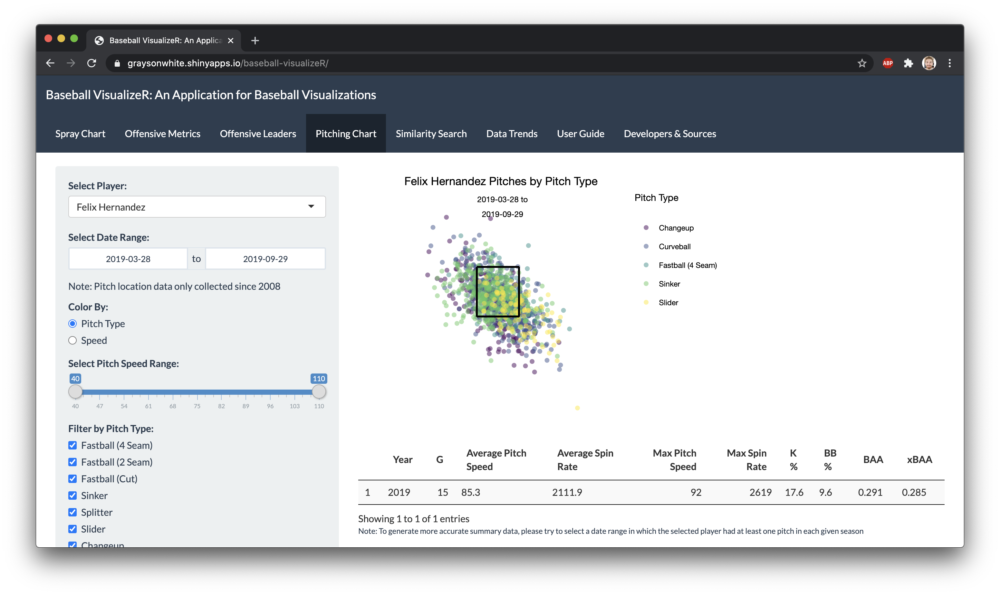

# Baseball VisualizeR: An Application for Baseball Visualizations

This app was created by [Riley Leonard](https://www.linkedin.com/in/riley-leonard-9653791a6/), [Jonathan Li](https://github.com/jonathanmli), and [Grayson White](https://www.github.com/graysonwhite) as a final project for Math 241: Data Science at Reed College in Spring 2020. The goal of this app is to allow the user to explore and visualize many of the advanced metrics that have been recorded for Major League Baseball since 2008.

This app is currently hosted on my `shiny` account, and can be accessed [here](https://graysonwhite.shinyapps.io/baseball-visualizeR/).

This app used baseball data and data acquistion functions from `baseballr`, `Lahman`, and `pitchRx`. Data visualization packages include `ggplot2`, `plotly`, `ggfortify`, `FNN`, and `scales`.
